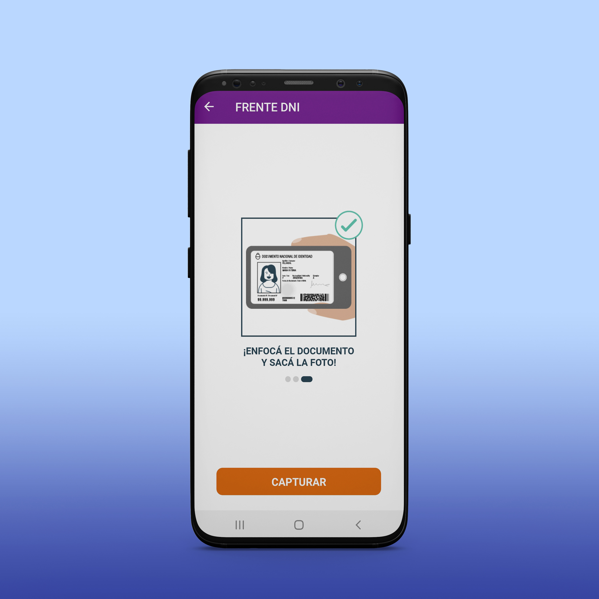
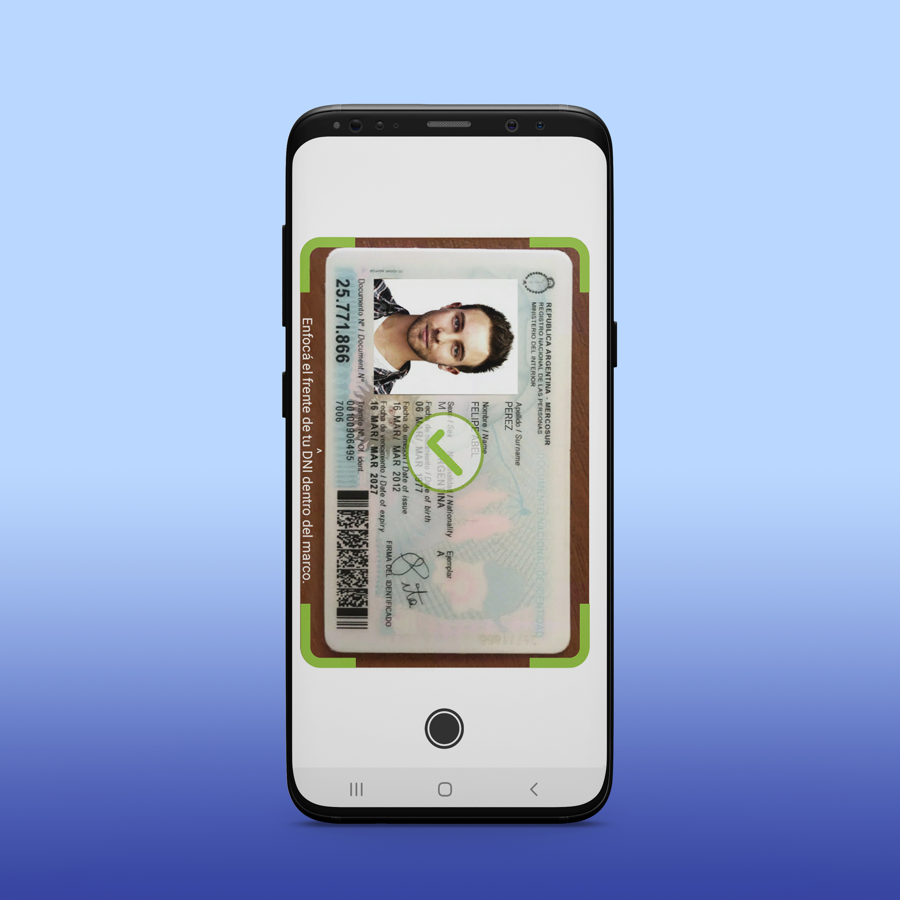
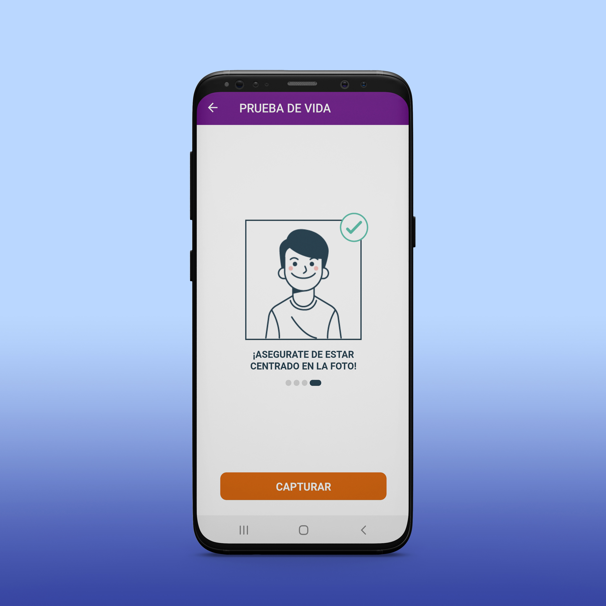
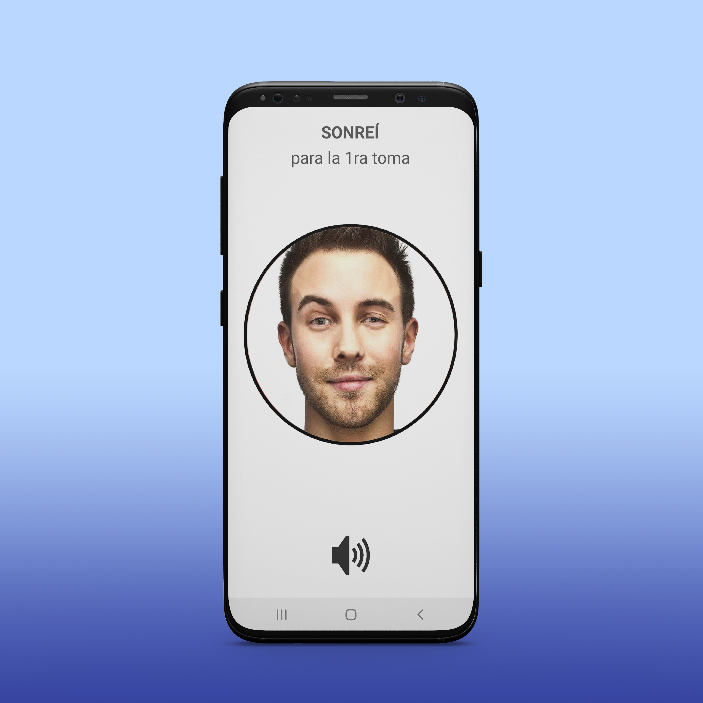

# SDK Xamarin del Servicio de Onboarding Digital de Nosis

Nosis Onbarding es una herramienta de validación de identidad a distancia, utilizando los
servicios de RENAPER para la solicitud de productos online en sitios web y aplicaciones móviles.

Este repo contiene información técnica destinada a ayudar a los desarrolladores a implementar
el SDK para aplicaciones móviles basadas en Xamarin Forms.

El servicio ofrecido por Nosis es exclusivamente de uso comercial y los ejemplos de este repo
requieren el uso de una api-key provista por Nosis.

# Screenshots

[]()
[]()

[]()
[]()

# Guía de uso rápido

El SDK de Onboarding Digital está diseñado para ser utilizado en aplicaciones Xamarin Forms.

## Instalación

El SDK se distribuye en un empaquetdo de NuGet, el mismo puede ser incorporado a un feed privado
de la empresa o un feed apuntando a un path local del equipo.

Luego, instalar el paquete Nuget en todos los proyectos de la solución (Android, iOS, Shared).

```
PM> install-package Nosis.Onboarding.SdkForms
```

Alternativamente, es posible renombrar el .nupkg a .zip y extraer el componente directamente.

## Configuración inicial

Antes de comenzar una validación es necesario configurar la API-KEY y el grupo de Onboarding, ambos suministrados por Nosis.

Opcionalmente, es posible suministrar pantallas de inicio personalizadas que se mostrarán al comenzar la actividad correspondiente.

```CSharp
Onboarding.Current.Settings.ApiKey = "clave-provista-por-nosis-con-formato-guid";

Onboarding.Current.Settings.GrupoOnb = 1;

Onboarding.Settings.FrontDniPageBuilder = () => new UserPage("PASO 1\r\nFRENTE DNI");
Onboarding.Settings.BackDniPageBuilder = () => new UserPage("PASO 2\r\nDORSO DNI");
Onboarding.Settings.SelfiePageBuilder = () => new UserPage("PASO 3\r\nSELFIE");
```

La *API-KEY* es necesaria para autenticar y asociar la actividad realizada a un cliente de Nosis.

El *GrupoOnb* identifica la parametría que se aplicará a las validaciones que se realicen.

## Configuración específica para iOS

Solo en el proyecto de iOS, es necesario agregar los recursos que se distribuyen en Resources_iOS.zip

## Inicio de nueva validación

Estando en una página de navegación de Xamarin, se comienza la actividad de Onboarding Digital
de la siguiente manera:

```CSharp
private async void Button_Clicked(object sender, EventArgs e)
{
	Onboarding.Settings.OnCompleted = ValidationCompleted;

	await Onboarding.Current.StartAsync(
	    dni: "22333444", 
	    sexo: "M");
}
```

Luego, para procesar el resultado de la validación se utiliza un callback 

```CSharp
private async Task ValidationCompleted()
{
    // La validación ha sido procesada en el servidor (Status != PENDIENTE)
    // Descargar del stack de navegación la página del SDK

    if (Onboarding.Current.Status == "OK")
    {
        // Validación superada
        // Examinar Onboarding.Current 
    }
    else
    {
        // Actuar en función del error
    }
}
```

## Resultado de una validación

Una vez finalizada la validación, se podrán examinar los distintos resultados obtenidos en el objeto de Onboarding.

```CSharp
// Onboarding.Current.Status

// Onboarding.Current.Dni.Photo
// Onboarding.Current.Dni.Barcode
// Onboarding.Current.Dni.Mrz

// Onboarding.Current.Selfie.Confidence
// Onboarding.Current.Selfie.Origin
// Onboarding.Current.Selfie.AvatarPicture
```
## Personalizar la apariencia

Algunos elementos visibles del SDK pueden ser personalizados para generar una apariencia homogénea con la app del usuario.

### Barra de navegación

El estilo de la barra de navegación se hereda automáticamente del estilo definido en la app.

```
<Style TargetType="NavigationPage">
    <Setter Property="BarBackgroundColor" Value="{StaticResource ColorVioleta}"/>
    <Setter Property="BarTextColor" Value="White"/>
</Style>
```

### Botones primarios y secundarios

Se asigna el color de texto y fondo del botón primario

```
<Color x:Key="Onb_BotonFondo">#E36600</Color>
<Color x:Key="Onb_BotonTexto">White</Color>
```

El botón secundario utiliza el borde del color primario y sin relleno

### Vista de espera

```
<Color x:Key="Onb_EsperaFondo">#690589</Color>
<Color x:Key="Onb_EsperaTexto">#E36600</Color>
```

### Vista de explicación personalizadas

El usuario puede crear sus propias vistas de explicación sobre cada actividad, las cuales
serán mostradas antes de la explicación animada que ofrece el SDK.

La forma de inyectar las vistas es la siguiente:

```
Onboarding.Settings.FrontDniPageBuilder = () => new UserPage("PASO 1\r\nFRENTE DNI");
Onboarding.Settings.BackDniPageBuilder = () => new UserPage("PASO 2\r\nDORSO DNI");
Onboarding.Settings.SelfiePageBuilder = () => new UserPage("PASO 3\r\nSELFIE");
```

## Códigos de error

| Status | Descripción |
|--------|-------------|
| OK | Todas las validaciones fueron superadas satisfactoriamente en el servidor |
| ABANDONADO | La persona no completó la validación |
| LIMITE_GENERAL | Superó la cantidad de validaciones diarias permitidas |
| LIMITE_ACIERTOS | Superó la cantidad de validaciones correctas que puede hacer en un día |
| LIMITE_FALLOS | Superó la cantidad de intentos fallidos que puede hacer en un día |
| ERR_SERVIDOR | Error interno en el servidor |
| DNI_ESTRUCTURA_INVALIDA | La ubicación de los elementos no coincide con ninguna de versión conocida de DNI |
| DNI_FOTO_NO_ENCONTRADA | El scanner no encontró la foto del DNI |
| DNI_FOTO_INVALIDA | La foto del documento no coincide con la selfie suministrada (obsoleto) |
| DNI_PDF417_NO_ENCONTRADO | El scanner no encontró el PDF417 del DNI |
| DNI_PDF417_INVALIDO | El formato del PDF417 no es reconocido |
| DNI_MRZ_NO_ENCONTRADO | El scanner no encontró el MRZ del DNI |
| DNI_MRZ_INVALIDO | El formato del MRZ no es reconocido o difieren los dígitos verificadores |
| DNI_DATOS_INVALIDOS | Los datos encontrados en el DNI no coinciden entre si o con los datos registrados en RENAPER |
| DNI_NO_VIGENTE | El DNI no está vigente en RENAPER o la fecha de vencimiento ha expirado |
| SELFIE_PRUEBA_INVALIDA | La persona no completó los desafíos de prueba de vida |
| SELFIE_ESCENA_NO_COINCIDE | Las selfies tomadas tienen fondos distintos |
| SELFIE_NEUTRAL_NO_ENCONTRADA | No se encontró un rostro neutral en la selfie |
| SELFIE_NEUTRAL_NO_COINCIDE | La selfie tomada no corresponde a la persona en cuestión |
| SELFIE_SONRISA_NO_ENCONTRADA | No se encontró un rostro sonriendo en la selfie |
| SELFIE_SONRISA_NO_COINCIDE | La selfie sonriendo no se corresponde con la selfie neutral |
| SELFIE_OJOSCERRADOS_NO_ENCONTRADA | No se encuentra un rostro con ambos ojos cerrados en la selfie |
| SELFIE_OJOSCERRADOS_NO_COINCIDE |	El rostro con ojos cerrados no coincide con el rostro neutral |
| SELFIE_MOV_NO_ENCONTRADA | No se encontró un giro de cabeza en la selfie |
| SELFIE_MOV_NO_COINCIDE | La selfie en movimiento no se corresponde con la selfie neutral |
| SDK_INTERNAL_ERROR | Error interno en el scanner |
| SDK_SERVER_ERROR | Problema de comunicación con el servidor  |
| SDK_PHOTO_NOT_FOUND | Scanner de DNI no pudo encontrar la foto  |
| SDK_BARCODE_NOT_FOUND | Scanner de DNI no pudo encontrar el PDF417 |
| SKD_MRZ_NOT_FOUND | Scanner de DNI no pudo encontrar el MRZ  |
| SDK_INVALID_LAYOUT | Scanner de DNI no pudo reconocer el formato  |
| SDK_INVALID_DATA | Scanner de DNI detecta diferencias entre el PDF417 y el MRZ  |
| SDK_NO_SUBJECT | Scanner de Selfie no encuentra un rostro |
| SDK_SUBJECT_TOO_CLOSE | Scanner de Selfie detecta rostro muy cercano  |
| SDK_SUBJECT_FAR_AWAY | Scanner de Selfie detecta rostro muy lejano |
| SDK_SUBJECT_TOO_DARK | Scanner de Selfie detecta imagen muy oscura |
| SDK_WAITING_GESTURE | Scanner de selfie finalizó esperando gesto |
| SDK_GESTURE_FAILED | Scanner de selfie finalizó luego de un gesto fallido |
| SDK_FINAL_POSE | Scanner de selfie finalizó mientras esperaba pose final |
